# Mama Yogis

Mama Yogis is presenting a life changing concept of practicing Yoga during prenatal and postpartum. The targeted people are local mums and mums to be who wish to increase their energy level, strengthen their body and mind for easier labour, quicker recovery and happier motherhood. The users of the site will be able to explore the range of the yoga classes provided, Opening time and location, and book a class which suits their time and fits their needs.

 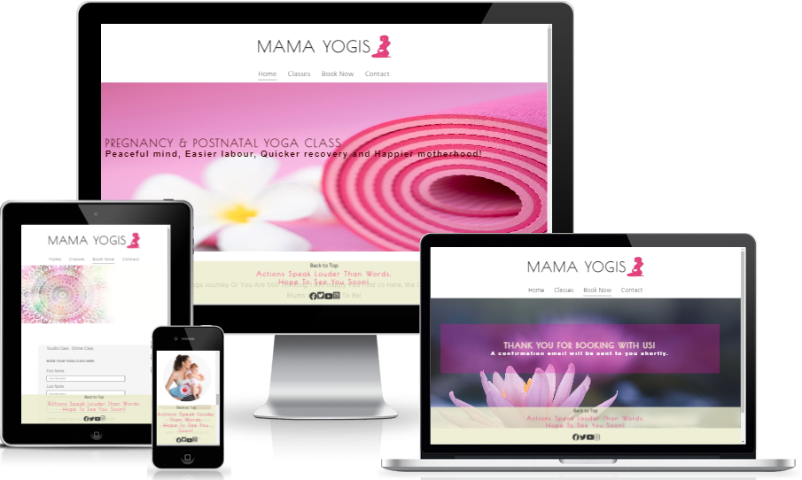

## Features

### Existing Features

- **Favicon**
   - A site wide favicon will be implemented with the pink pregnant women keeling icon.
   - The Mama Yogis' logo will appear in the the tabs header to allow the user to easily identify the website while multiple tabs open.

   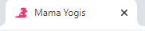

- **Logo and Navigation Bar**

   - An eye catching logo of "Mama Yoga" with a pink beautiful pregnant woman kneeling icon (having a heart in the belly), says all about this site. It also contains the link of the home page.
   - The responsive navigation bar sits underneath the logo, including Home, Classes, Book Now and Contact, which is identical in all the other pages. 
   - This will provide users easy navigation on the site from section to section and page to page. It works responsively in different device sizes.

   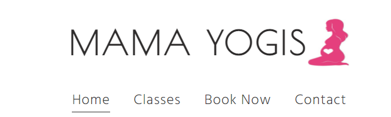

- **Home page main image**

   - By landing on this welcoming background image, users will see a pink yoga mat and a beautiful blooming white Lily next to it. 
   - It hints that "Besides a Mum, you are still yourself. Mums can be fit, healthy and pretty just like the blooming flower." 
   - This image is fixed to the viewport of the block and it allows the cover message gradually scroll over it, which gets users attention to the message itself.
   - The cover message provides users the main yoga style and the overall benefits of practising yoga at those special life stages. It initiates the users' willing to take participation.

   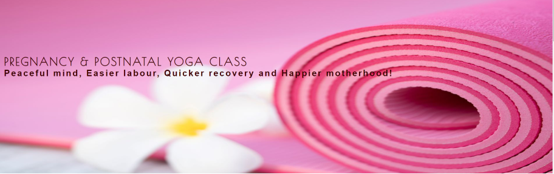

- **Classes Section**

   - This section lists out the classes provided by the site owner. Each class is illustrated with a supporting photo image and few short text paragraphs. 
   - The photo images give the users a feeling of how the class looks like and the paragraphs provides the details of what benefits the users can expect from each class respectively.   
   - There is a "Book Now" button next to each class title, which will redirect the users to the relevent booking section at Book Now page. It is convenient for users to book the class right after identifying each class type, instead of going back to the top of the page for navigation to the booking page.

   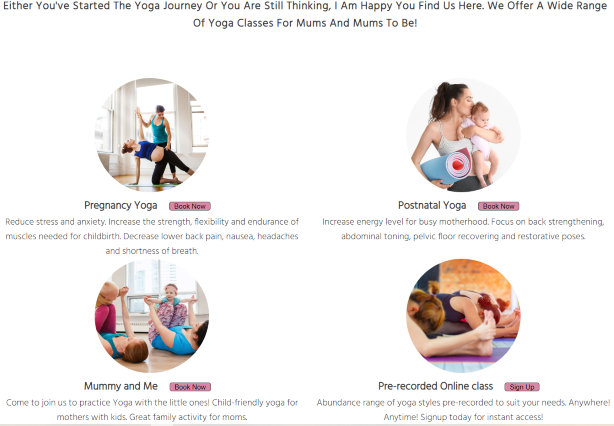

- **Contact Section**

   - At this section, users will see where Yoga Mama is located, how to contact them and their opening time.
   - The *tel:* and *mailto:* protocols are coded to telephone and email. After a click, the phone number will be added to the dial box ready to dial and users’ mail box will be opened with a recipient email address filled. 

   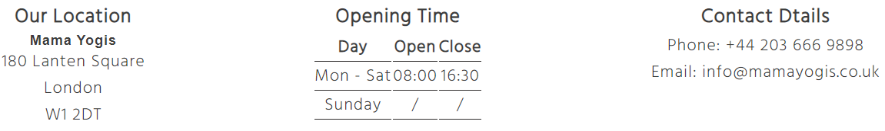

- **Footer**

   - This Footer section is fixed to the bottom of the viewport and it is always there while users scroll up and down the page. 
   - It contains a phrase to encourage users to take the action and start the class. Also the links to the relevant social media sites for Mama Yogis are centered at the bottom line. Each link will open to a new tab to allow easy navigation for users.

- **Back to Top icon**

   - This back to top icon is fixed to the footer at the top center for users to quickly jump back to the top of the active page without scrolling.

   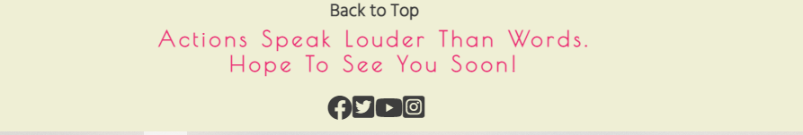

- **Book Now Page**

   - This Booking page contains the booking forms for studio class and online class. The Book Now and Sign Up button at the classes section will redirect the users to the specific booking form for the particular class. 
   - Furthermore, there is navigation bar by class type at the top of the form section to help user to quickly go to the right booking section.

   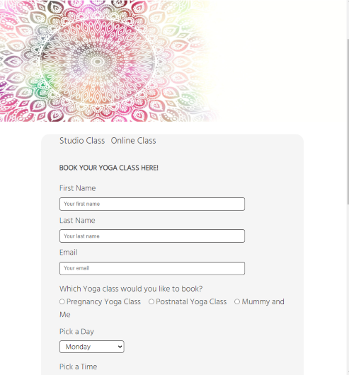
   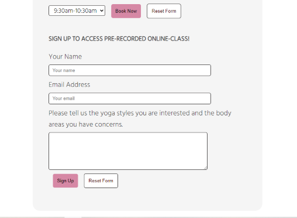

- **Thank You Page**

   - This page will pop out after users submitting the form and it gives a thank you / conformation message to show a successful booking.

   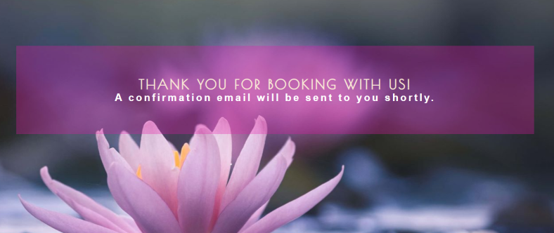

## Features left to implement

- As the submiitted data from form is currently not stored to the server, therefore a further implementation is to build a database.
- Form can be simplified by using JavaScript to filter the different time for different class without adding notes next to each time options.
- Reflexiable images will avoid having images pixelated or unnecessarily stretched. I will look into it When the time and resource become available. 

## Technologies

- *HTML*
   - The structure of the Website was developed using HTML as the main language.
- *CSS*
   - The Website was styled and layed out using CSS in an external file.
- *Visual Studio Code*
   - The website was developed using Visual Studio Code IDE
- *GitHub*
   - Source code is hosted on GitHub and delpoyed using Git Pages.
- *Git*
   - Used to commit and push code during the development of the Website
- *Font Awesome*
   - Icons obtained from https://fontawesome.com/ were used as the Social media links in the footer section.
- *Tinyjpg*
   - All the images used throughout the website were reduced size at https://tinyjpg.com/ 
- *Favicon.io*
   - Favicon files were created at https://favicon.io/favicon-converter/
- *Am I Responsive*
   - Screen shots of the various device breakpoints for the website were produced at https://ui.dev/amiresponsive/

## Testing

### Responsiveness

All pages were tested to ensure responsiveness on screen sizes from 320px and upwards on Chrome, Edge and Firefox.

*Steps to test*:

- Open browser and paste https://yuyizhong.github.io/mama-yogis to address bar to navigate.
- Right click on the webpage and then inspect to Open the developer tools
- Set to responsive and decrease width to 320px and the zoom to 50%
- Click and drag the responsive window to maximum width

*Result*:

- Website is responsive on all screen sizes and no images are pixelated or stretched. No text were overflowed or cut off. No contents were out of their box or get overlapped.

### Accessibility

[WAVE Web Accessibility Evaluation Tools](https://wave.webaim.org/) was used throughout development and for final testing of the deployed website to check for any aid accessibility testing. 

*Result*
- 0 Errors and 0 Contrast errors.
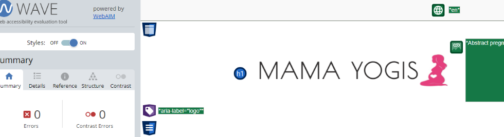

 - Issue fund during the page development:
   - I originally used 3 identical forms for 3 studio yogo classes booking. All the lables are the same besides the options of the time are different for each class. 
 - Fix:
   - I simplify the forms into 1. As without using JavaScript, I wont be able to provide the relevant time options based on the yoga class selected. I then only add one more radio choice for users to select the yoga class and then put all the time slots in the select drop down list, with class name next to each time slot. 

   

